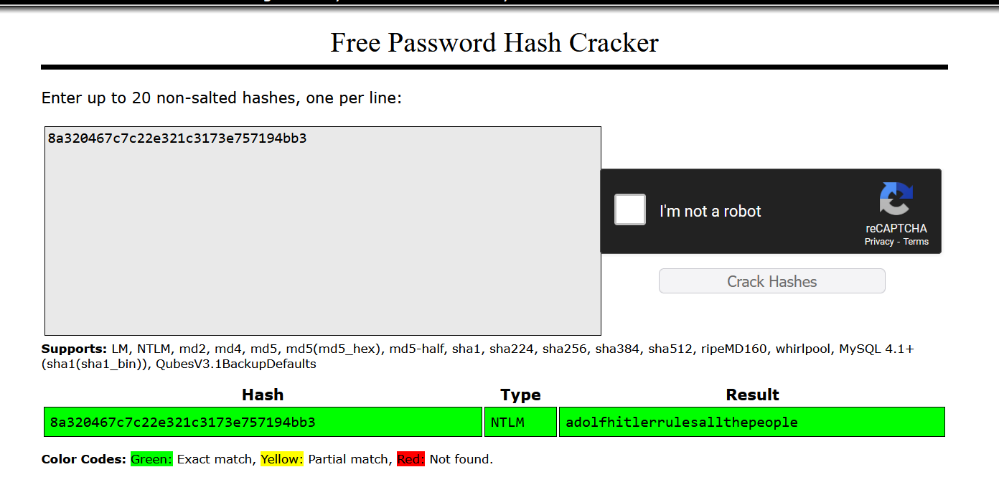

# Forensics

# BITSCTF

# Access Granted:

Format for flag is BITSCTF{password}

Find a flag from mem dump. 

Verification of a user is done by a password. The system hashes the password using  MD4 hashing algo called NTLM hash. Which is then stored in SAM database or in active directory, which could be the case here. During authentication hashes are compared. If NT hash of the entered password matches the one stored in system, user is authenticated.

Now NT hash can be cracked using crackstation or dictionary. 

Now if we use volatility : vol -q -f and then navigate to the hashdump itself we can see that in user MogamBro, we have the NT hash 8a320467c7c22e321c3173e757194bb3 corresponds to the password for Mogambro user.

Run it online 

found the flag

# Bypassing Transport Layer

TCP connection, we’ll use wireshark for this. Toiled for hours with his, 

.pcap contains records of network packets, transmitted over a network. 

SSL/TLS is used secure packet. But it’s unreadable because it’s encrypted. 

So for this we need TLS session keys. 

In the desktop directory we can find the TLS keys, now go to wireshark → protocls → TLS and point wireshark to the keys files

As decryption occurs, you can see that there’s HTTP2 packets, look like images and HTML. Export them, strings them and grep to BITS, find the key.

# I’m wired in

‘Keyboard’ was mentioned so we definitely need to look for keylog.pcap or something. I could see that in desktop directory, there was a key file. 

Found a rep called USBKey translator, retrieves HID data from packet

$ python [USBkeysTranslator.py](http://usbkeystranslator.py/) keylog.pcapng

[+] Using filter "usbhid.data" Retrived HID Data is :

I haveebeen haakee  !!!
HELLMEE
BITSCTF{I_-7h1nk_th3y_4Re_k3yl0991ng_ME!}

MogamBro

# Mogambro’s guilty pleasure

Dear Friend , We know you are interested in receiving
red-hot information . We will comply with all removal
requests . This mail is being sent in compliance with
Senate bill 1622 , Title 9 ; Section 305 . THIS IS
NOT MULTI-LEVEL MARKETING ! Why work for somebody else
when you can become rich as few as 24 weeks ! Have
you ever noticed nearly every commercial on television
has a .com on in it plus nearly every commercial on
television has a .com on in it ! Well, now is your
chance to capitalize on this ! WE will help YOU deliver
goods right to the customer's doorstep and deliver
goods right to the customer's doorstep ! You can begin
at absolutely no cost to you . But don't believe us
! Mrs Jones of New Mexico tried us and says "I've been
poor and I've been rich - rich is better" ! We are
licensed to operate in all states . We IMPLORE you

act now ! Sign up a friend and you get half off !
Thanks . Dear Salaryman ; Your email address has been
submitted to us indicating your interest in our letter
. If you no longer wish to receive our publications
simply reply with a Subject: of "REMOVE" and you will
immediately be removed from our mailing list . This
mail is being sent in compliance with Senate bill 1627
, Title 6 , Section 303 . This is not multi-level marketing
. Why work for somebody else when you can become rich
as few as 70 WEEKS ! Have you ever noticed people love
convenience and most everyone has a cellphone ! Well,
now is your chance to capitalize on this . WE will
help YOU process your orders within seconds plus turn
your business into an E-BUSINESS . You are guaranteed
to succeed because we take all the risk . But don't
believe us ! Prof Ames of Louisiana tried us and says
"I've been poor and I've been rich - rich is better"
! We are licensed to operate in all states . Do not
delay - order today ! Sign up a friend and you'll get
a discount of 50% . Thank-you for your serious consideration
of our offer .

This is the mail

When we open the YOU WON A LOTTERY eml file under Outlook it matches the downloads file `lottery.exe` which is just a mere distraction.

However the other link 50% discount on plushies is a `spam mimic link` and has hidden flag behind it.

> FLAG -> BITSCTF{sp4m_2_ph1sh_U}
> 

# Shunya CTF

# Bluetooth ftw

Opening bluetooth.pcap

Packets look like person has been adjusting the volume levels. Stumped me for a second , thought it had something to do with waveforms or shit, then as I was going over crests and trough, it hit me. More

`-... .-.. . ..--.- ..-. - .--`

BLE_FTW

idk im blank

# Hitcon #Unsolved

# Blackhat

USB100

Send.pcapng, opened in wireshark. 

I was blank, I check packets and it was nothing, I was messing around with ordering of lengths, sorted high lest, found hex value here. 
Decoded it. Output was an image.  Still lost dk what to do. 

Maybe I should check them one by one. Went on chatgpt, they said copy > value would work but use binwalk. Looked at stackoverflow

The was an exe file , renamed it to ctf {ls | python -c 'import sys, os; print(len([os.system("mv %s ctf.%s" % (name, name.split(".")[1])) for name in sys.stdin]))' } then used wine to run ctf

wine ctf.exe

`BHflagy{1d3cbfa0e052b1729a00950e9fc0f61a3f393bc97c0c74c8ecab1b58cd0f95c32e4c970bdfa6e23371d50680ca0c37f61f7206974d20d5cbb2f00151f4735dde}`